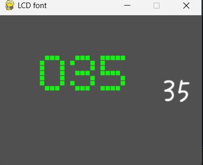

# pygame_samples演習
### ステップ2

#### demo_01.py
ウィンドウサイズ
>~~~
>screen = pygame.display.set_mode([640, 480])
>~~~

ウィンドウの名前
>~~~
>pygame.display.set_caption("pygame demo - window title here")
>~~~

ウィンドウの背景の色
>~~~
>screen.fill((238, 238, 170))
>~~~

図形の種類、色、座標、大きさ
>~~~
>pygame.draw.circle(screen, (176, 176, 222), (320, 240), 120)
>pygame.draw.circle(screen, (222, 176, 222), (120, 120), 20)
>pygame.draw.circle(screen, (222, 176, 222), (120, 120), 20)
>pygame.draw.rect(screen, (120, 120, 120), Rect(120, 120, 200, 120))
>~~~

動く点のon,offそれぞれの色
>~~~
>color_on = (240, 120, 120)
>color_off = (120, 120, 120)
>~~~

動く点の四角の横の数
>~~~
>for x0 in range(5):
>~~~

動く点の四角の縦の数
>~~~
>for y0 in range(7):
>~~~

### ステップ3
#### demo_01.py
最初
>x座標を1ずつ増やす
>>~~~
>>x1 += 1
>>~~~
>もしx座標が4ならx座標を0にする
>>~~~
>>if x1 > 4:
>>    x1 = 0
>>~~~
>
>
>https://github.com/user-attachments/assets/9cdcd9fb-195e-4570-835f-3a9d4dff44cf
>
>
変更後
>x座標を1ずつ増やす
>>~~~
>>x1 += 1
>>~~~
>もしx座標が4ならx座標を0にしてy座標を1増やす
>>~~~
>>if x1 > 4:
>>    x1 = 0
>>    y1 += 1
>>~~~
>もしy座標が6ならy座標を0にする
>>~~~
>>if y1 > 6:
>>    y1 = 0
>>~~~
>
>
>https://github.com/user-attachments/assets/f54b113f-3504-48f6-ab05-73635783311e
>
>
### ステップ4
#### demo_LCD_font_01.py lcd_font_pg.py
0~9を表示させる
>lcd_font_pg.pyに自分のドットマトリックスをかく。
>>~~~
>>LCD_3 = (0, 1, 1, 1, 0,
>>         1, 0, 0, 0, 1,
>>         0, 0, 0, 0, 1,
>>         0, 1, 1, 1, 0,
>>         0, 0, 0, 0, 1,
>>         1, 0, 0, 0, 1,
>>         0, 1, 1, 1, 0)
>>
>>LCD_4 = (0, 0, 0, 1, 0,
>>         0, 0, 1, 0, 0,
>>         0, 1, 0, 1, 0,
>>         1, 0, 0, 1, 0,
>>         1, 1, 1, 1, 1,
>>         0, 0, 0, 1, 0,
>>         0, 0, 0, 1, 0)
>>
>>LCD_5 = (1, 1, 1, 1, 1,
>>         1, 0, 0, 0, 0,
>>         1, 0, 0, 0, 0,
>>         1, 1, 1, 1, 0,
>>         0, 0, 0, 0, 1,
>>         0, 0, 0, 0, 1,
>>         1, 1, 1, 1, 0)
>>
>>LCD_6 = (0, 0, 1, 0, 0,
>>         0, 1, 0, 0, 0,
>>         1, 0, 0, 0, 0,
>>         1, 1, 1, 1, 0,
>>         1, 0, 0, 0, 1,
>>         1, 0, 0, 0, 1,
>>         0, 1, 1, 1, 0)
>>
>>LCD_7 = (1, 1, 1, 1, 1,
>>         1, 0, 0, 0, 1,
>>         1, 0, 0, 0, 1,
>>         0, 0, 0, 1, 0,
>>         0, 0, 1, 0, 0,
>>         0, 0, 1, 0, 0,
>>         0, 1, 0, 0, 0)
>>
>>LCD_8 = (0, 1, 1, 1, 0,
>>         1, 0, 0, 0, 1,
>>         1, 0, 0, 0, 1,
>>         0, 1, 1, 1, 0,
>>         1, 0, 0, 0, 1,
>>         1, 0, 0, 0, 1,
>>         0, 1, 1, 1, 0)
>>
>>LCD_9 = (0, 1, 1, 1, 0,
>>         1, 0, 0, 0, 1,
>>         1, 0, 0, 0, 1,
>>         0, 1, 1, 1, 1,
>>         0, 0, 0, 0, 1,
>>         0, 0, 0, 1, 0,
>>         0, 0, 1, 0, 0)
>>
>>LCD_font_styles = (LCD_0, LCD_1, LCD_2, LCD_3, LCD_4, LCD_5, LCD_6, LCD_7, LCD_8, LCD_9)
>>~~~
>
>demo_LCD_font_01.pyで何の数字を表示するか決める
>>~~~
>>code = int((x / 8) % 3)
>>~~~
>>変更後↓↓
>>~~~
>>code = int((x / 8) % 10)
>>~~~
複数の数字を表示できるようにする
>codeとlcd1.update_colを増やす
>>~~~
>>code = int((x / 8) % 10)
>>lcd1.update_col(col=0, code=code)
>>~~~
>>変更後↓↓
>>~~~
>>code = int((x / 8) % 10)
>>code1 = int((x / 10 / 8) % 10)
>>code2 = int((x / 100 / 8) % 10)
>>lcd1.update_col(col=0, code=code2)
>>lcd1.update_col(col=1, code=code1)
>>lcd1.update_col(col=2, code=code)
>>~~~

